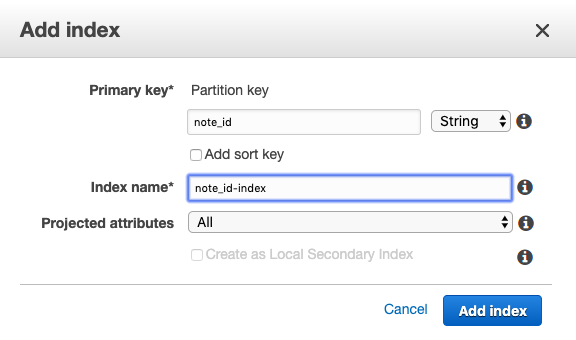
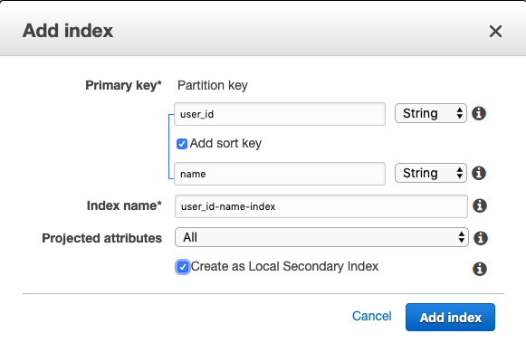
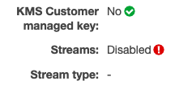
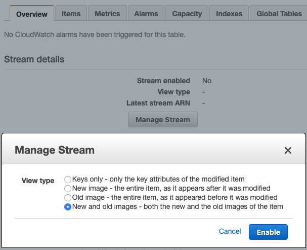
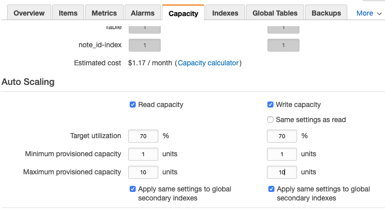
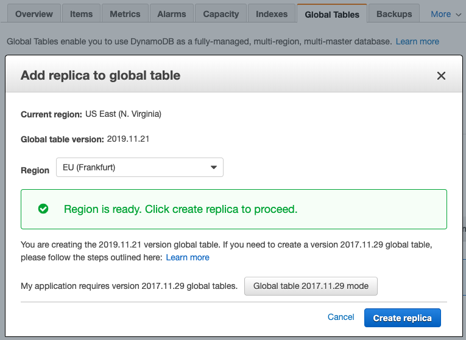

# AWS DynamoDB - The Complete Guide

## SECTION 11-12: Cross-Region Replication Using Global Tables and Auto-Scaling

### Creating the Global Table (11.65)

1. Create a new table
2. Add two LSIs and one GSI

-   GSI: note_id-index
-   LSI: user_id-cat-index
-   LSI: user_id-title-index

    
    

3. Create table.
4. The course is out of date here.  
   
    - The requirements for a global table have changed. It no longer needs to be empty, but you do still need to enable Streams. Overview > Manage Stream > New and Old Images
      
    - It instructed you to not enable auto-scaling in the previous step as this is demonstrated in section 12. However, you can no longer create a global table without auto scaling enabled. So, go to the Capacity tab and update the settings as below:
      
5. Resume as instructed: go to the Global Tables tab and add a replica to the Frankfurt region. You should get a success message after a few seconds.
   
6. Another minor change since the course was created: Dynamo no longer shows you the aws:rep:updateregion and aws:rep:updatetime attributes, so there is no need to worry about deleting or duplicating them.

### Table Operations (11.67)

The note in 11.66 is helpful, see [Section11-12/globalTables.js](../Section11-12/globalTables.js) for an alternative to setting and resetting the AWS.config region property.

### Auto-Scaling

As noted above, the course is out of date. 12.68 is relevant, 12.69 had to be rolled into 11.65 above.

For 12.70-71, the challenge was to trigger auto-scaling by writing code to initiate full-table scans on intervals. If you completed the WCU exercise in 12.70, there should be enough records in the table for this, but you also need to add pagination logic. Since the pagination section of this course is currently far enough out of date that it does not work even with the 'solved' code, I looked around a little for a solution to the pagination issue. I don't think it is a robust solution, but it worked for this exercise. I would look more deeply into this for production code.

-   I adapted the callback solution from [this github repo](https://gist.github.com/andrhamm/dd5bcb41cb32ed1818259b88c7a48d7e).
-   My solution to pagination is in [Section11-12/bulkReads.js](../Section11-12/bulkReads.js)
-   It can be tested in both regions by commenting/uncommenting the desired instantiation.

**NOTE**: You will want to have the 'expires' and 'timestamp' attributes created as described in this lecture. Don't skip or change the faker syntax if you want to easily follow along on the following exercises.
