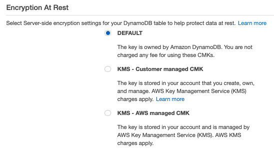

# AWS DynamoDB - The Complete Guide

## SECTIONS 15-21

Since the services in these exercises are not reliably part of the free tier, I did not execute most of them, just watched the videos.

---

### DAX (Section 15)

-   [amazon-dax-client](https://www.npmjs.com/package/amazon-dax-client)
-   DAX endpoints cannot be accessed from outside the VPC (Error code: NoRouteException), 15.76 addresses the solution to this

### On-Demand Backup & Restore (Section 16)

-   Create backups manually, or use the sdk and lambda to schedule creation and deletion of backups
-   PITR always restores data to a new table

### Server-Side Encryption at Rest (Section 17)

Note: there is no additional charge for SSE, and Key Management Service is free [to a point](https://aws.amazon.com/kms/pricing/). Also the GUI has changed since the course was last updated, they tell you the default setting is free, but the customer managed keys may result in charges:

-   Uses 256-bit AES Encryption with AWS KMS
-   Can only be enabled at the time of table creation, not after the fact
-   Once encryption is enabled on a table, it cannot be disabled
-   Happens internally so your app does not have to handle any of the logic
-   Once you create a table with encryption, you can see that it is enabled in the Overview pane, but the data will still be human readable in the table

### Logging with CloudTrail (Section 18)

-   Free... but not? Engage at your own [risk](https://aws.amazon.com/cloudtrail/pricing/). Since I acquired CloudWatch charges in Frankfurt from a previous exercise, I don't recommend it.

### Importing and Exporting Using Data Pipeline (Section 19)

-   [Pricing](https://aws.amazon.com/codepipeline/pricing/)

### Querying with Redshift (Section 20)

-   Redshift has a 2 month free trial (as of this writing, April 2020), and after that: [pricing](https://aws.amazon.com/redshift/pricing/)
-   This exercise requires SQL workbench (or the Mac equivalent)
-   Be aware of the [differences](https://hevodata.com/blog/dynamodb-to-redshift-methods-move-data/) between what is allowed in DynamoDB vs Redshift requirements

### Apache Hive and EMR (Section 21)

-   [EMR pricing](https://aws.amazon.com/emr/pricing/)
-   Elastic MapReduce / Managed Hadoop Cluster
-   Hive is a data warehousing solution for Hadoop
-   This exercise requires SQL workbench (or the Mac equivalent)

### CloudSearch (Section 22)

Note: 22.91 uses the npm package 'async' again. This is a very popular library but was last used here in the pagination exercise that does not work, even with the instructor's updated solution code. Since I am not executing the non-free tier courses myself, I can't speak to whether or not this one will work. Vanilla async/await would have been easier to debug, IMO.

-   [CloudSearch pricing](https://aws.amazon.com/cloudsearch/pricing/)
-   As of April 2020, you can try CloudSearch free for 30 days, up to 750 hours
-   CloudSearch scales based on demand, and features highlighting, autocomplete, and geospatial search.
-   This will only work on a copy of a DynamoDB Table, so you can use a trigger + lambda to automatically upload items to the CloudSearch index when they are added to the table.

### CloudWatch and IAM (Sections 23-24)

-   Both of these are central to using AWS safely and effectively
-   CloudWatch logs are essential when debugging lambdas, etc.
-   For your personal account it's not a bad idea to understand IAM; in a work setting this is likely managed by DevOps or your equivalent.
