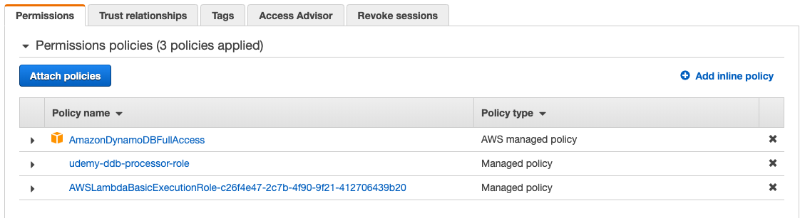

# AWS DynamoDB - The Complete Guide

## SECTION 9: Advanced DynamoDB

[DAX](https://docs.aws.amazon.com/amazondynamodb/latest/developerguide/DAX.html): DynamoDB Accelerator

[Global Tables](https://docs.aws.amazon.com/amazondynamodb/latest/developerguide/GlobalTables.html): Reduces latency across geographical regions.

### DynamoDB Streams

DynamoDB Streams maintains a time-ordered log of all the changes in the given table. This log stores all the write activity from the last 24 hours. This has applications for replication, logging, archiving, notifications, and more.

You can use Kinesis Adapter, or the DynamoDb Streams SDK, but the simplest approach is to use AWS Lambda functions.

1. To enable Streams, log in to the DDB console and select the table you want to use. From the Overview tab, click Manage Stream. Choose the option that suits your needs. In this exercise, we used 'New and Old Images.'

2. In order to capture the data from the Stream, you need to set up a trigger. Go to the Triggers tab. For this exercise, click Create Trigger > New Function.

### DynamoDb Triggers, with AWS Lambda

The TTL (Time to Live) attribute allows us to tell DynamoDb when to delete an item from the table.

-   Defines expiry timestamp of the item with either EPOCH or UNIX timestamps
-   Expired items are removed from the table and indices within 48 hours
-   Your application should use filter operations if you want to exclude items marked for deletion, since you can't be sure they will be deleted by the exact moment you specified.
-   You can use Streams and Triggers to move items from the current table to another one upon expiry, keeping your 'hot' and 'cold' partitions separate for best efficiency.

---

**Note:** The resources on this course are outdated (as of April 2020).

-   The AWS GUI has changed and the policy JSON provided by the instructor does not grant the needed permission for the dynamo trigger. I tried the AWSLambdaBasicExecutionRole, but even though I added the specs it said it needed, I couldn't set up the trigger. Ultimately, I added the full-access policy to the role, in addition to a custom one:



-   The custom role includes the following:

```json
{
    "Version": "2012-10-17",
    "Statement": [
        {
            "Effect": "Allow",
            "Action": ["lambda:InvokeFunction"],
            "Resource": ["*"]
        },
        {
            "Effect": "Allow",
            "Action": [
                "dynamodb:DescribeStream",
                "dynamodb:GetRecords",
                "dynamodb:GetShardIterator",
                "dynamodb:ListStreams",
                "logs:CreateLogGroup",
                "logs:CreateLogStream",
                "logs:PutLogEvents"
            ],
            "Resource": "*"
        }
    ]
}
```

-   In addition, the lambda GUI will not look the same, the "Resources the function's role has access to" section is no more. You can look under the 'Permissions' tab, Resource Summary > by Resource to see the services to which it has access.

-   The handler code has changed, there is no longer a callback argument.

---
